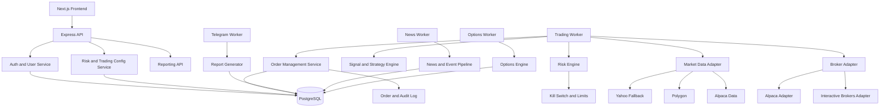

# Real-Money Autonomous Trading Blueprint

## Executive Summary

This project can be evolved into a professional autonomous trading platform, but it is not yet architecturally ready for unattended real-money trading.

The goal of this blueprint is not to promise returns. No software architecture can guarantee profit in the near future. The correct engineering goal is:

- preserve capital first
- limit operational and broker risk
- make order flow observable and auditable
- ensure the bot fails safe under bad data, rate limits, process restarts, and broker errors

## Architecture Decisions

### ADR-001: Keep a Modular Monolith for API, Split Workers by Runtime Role

Decision:

- Keep the web API and frontend integration as a modular monolith in the near term
- Move autonomous trading, Telegram reporting, news monitoring, and options scanning into separate worker processes

Rationale:

- The current codebase is already one deployable backend with large shared services
- Splitting into microservices now would add operational complexity faster than it reduces risk
- Separate worker roles solve the biggest production problem immediately: every app restart currently starts all schedulers

Current evidence:

- Scheduler/report startup is coupled into [backend/src/app.js](backend/src/app.js#L133)
- Trading and background jobs start on web boot in [backend/src/app.js](backend/src/app.js#L311)
- Options scanning starts on web boot in [backend/src/app.js](backend/src/app.js#L317)
- Options bot starts on web boot in [backend/src/app.js](backend/src/app.js#L321)
- News monitoring starts on web boot in [backend/src/app.js](backend/src/app.js#L325)

### ADR-002: PostgreSQL Must Become the Only Source of Truth

Decision:

- Move all user settings, AI-trading settings, risk config, Telegram config, and trading control flags into PostgreSQL
- Remove request-path dependencies on `users.json`

Rationale:

- Real-money systems cannot tolerate split-brain user state
- Auth already uses PostgreSQL, but trading routes still mutate JSON files
- File-based state is unsafe for concurrent workers and multi-instance deployments

Current evidence:

- Auth uses PostgreSQL in [backend/src/middleware/authMiddleware.js](backend/src/middleware/authMiddleware.js#L12)
- DB-backed user service exists in [backend/src/services/userDatabaseService.js](backend/src/services/userDatabaseService.js#L34)
- Legacy route still reads JSON in [backend/src/routes/aiTradingRoutes.js](backend/src/routes/aiTradingRoutes.js#L8)
- Legacy route still writes JSON in [backend/src/routes/aiTradingRoutes.js](backend/src/routes/aiTradingRoutes.js#L48)
- Enhanced route still reads and writes JSON in [backend/src/routes/enhancedAITradingRoutes.js](backend/src/routes/enhancedAITradingRoutes.js#L8)

### ADR-003: Secure All Trading Mutation Endpoints

Decision:

- Require authentication on every trading-related route
- Add authorization so users can only manage their own accounts unless explicitly admin-authorized
- Separate internal operator endpoints from user-facing endpoints

Rationale:

- A real-money system needs a hard trust boundary around every action that can place trades, alter risk limits, or toggle automation

Current evidence:

- Protected trading routes exist in [backend/src/routes/aiTradingRoutes.js](backend/src/routes/aiTradingRoutes.js#L11)
- Unprotected mutation endpoints exist in [backend/src/routes/enhancedAITradingRoutes.js](backend/src/routes/enhancedAITradingRoutes.js#L13)
- Additional unprotected mutation endpoints exist in [backend/src/routes/enhancedAITradingRoutes.js](backend/src/routes/enhancedAITradingRoutes.js#L78)
- Market scan trigger is unprotected in [backend/src/routes/enhancedAITradingRoutes.js](backend/src/routes/enhancedAITradingRoutes.js#L138)
- Trade execution trigger is unprotected in [backend/src/routes/enhancedAITradingRoutes.js](backend/src/routes/enhancedAITradingRoutes.js#L163)

### ADR-004: Standardize on Explicit Broker and Data Provider Adapters

Decision:

- Keep the broker abstraction pattern already present
- Remove hidden global monkey-patching from bootstrap over time
- Make every trading and market-data dependency explicit through adapter interfaces

Rationale:

- Explicit dependencies are mandatory for testing, auditability, and broker cutover safety
- Hidden process-wide patching increases operational ambiguity

Current evidence:

- The broker abstraction already exists in [backend/src/services/brokerService.js](backend/src/services/brokerService.js)
- The market-data abstraction already exists in [backend/src/services/dataProvider.js](backend/src/services/dataProvider.js)
- Global runtime patching still exists in [backend/src/app.js](backend/src/app.js#L8)

### ADR-005: Target Broker Strategy

Decision:

- Near term: keep Alpaca as the existing execution path for paper and limited live rollout
- Strategic target broker: Interactive Brokers for long-term real-money production

Rationale:

- Alpaca is already integrated in [backend/src/services/brokerService.js](backend/src/services/brokerService.js) and is the fastest route to controlled paper validation
- Interactive Brokers is generally the stronger long-term broker choice for a serious autonomous trading system because of market access, account types, asset coverage, and broker maturity
- The current repo should not jump straight to IBKR live trading without first hardening the platform boundaries, safety controls, and observability

Recommendation:

- Phase 1 to Phase 3: paper-trade and shadow-trade on Alpaca
- Phase 4: add an `ibkr` broker adapter behind the existing broker abstraction
- Phase 5: cut over live execution only after production readiness gates are met

## Recommended Target Architecture

## Production Readiness Gaps

### 1. Security and Trust Boundary

- Unauthenticated trading control routes
- No explicit admin/operator boundary
- Secrets appear to be handled through startup scripts and env injection rather than centralized secret management

### 2. State Consistency

- Mixed PostgreSQL and JSON persistence for users and AI-trading settings
- Risk of scheduler behavior diverging from route behavior

### 3. Runtime Isolation

- API and workers are in the same process
- Restarting the web app changes scheduler state and startup catch-up behavior

### 4. Order Safety

- Broker abstraction exists, but the system still needs a stronger order state machine
- Required states: `proposed`, `risk_rejected`, `submitted`, `acknowledged`, `partially_filled`, `filled`, `canceled`, `rejected`, `reconciled`

### 5. Observability

- Logging exists, but real-money readiness needs structured order lifecycle logs, broker reconciliation logs, PnL snapshots, and alerting

### 6. Strategy Modularity

- Major services are oversized and contain multiple concerns
- Hotspots include [backend/src/services/weeklyPredictionService.js](backend/src/services/weeklyPredictionService.js), [backend/src/services/enhancedAITradingBot.js](backend/src/services/enhancedAITradingBot.js), [backend/src/services/autonomousOptionsBot.js](backend/src/services/autonomousOptionsBot.js), and [backend/src/services/multiModelAIService.js](backend/src/services/multiModelAIService.js)

## Recommended Phased Implementation

### Phase 0: Safety First

Objective:

- prevent accidental real-money damage while architecture is still being corrected

Tasks:

- keep `BROKER=simulated` or `alpaca` paper only
- require auth on enhanced AI trading routes
- disable any route that can execute live orders without an authenticated user context
- add a global kill switch and per-user kill switch in PostgreSQL
- add max daily loss, max position count, max sector concentration, and max order notional controls

Exit criteria:

- no unauthenticated trading mutations
- all automation can be disabled at runtime without restart

### Phase 1: Source-of-Truth Consolidation

Objective:

- eliminate split-brain state

Tasks:

- migrate all `users.json` trading settings to PostgreSQL
- move Telegram user linkage and AI-trading config into DB tables
- remove request-path reads and writes of `users.json`

Exit criteria:

- user, trading, and reporting settings come only from PostgreSQL

### Phase 2: Runtime Separation

Objective:

- isolate API from automation

Tasks:

- create separate startup entry points for:
  - API server
  - trading worker
  - Telegram reporting worker
  - news/options workers
- ensure only worker processes own schedules

Exit criteria:

- web process contains zero autonomous schedulers

### Phase 3: Order Management and Risk Engine Hardening

Objective:

- make every trade auditable and bounded by risk policy

Tasks:

- create an order management service with explicit order states
- require pre-trade risk validation before broker submission
- persist broker order IDs, fill IDs, timestamps, and reconciliation state
- add broker/account reconciliation loop

Exit criteria:

- every order can be reconstructed from DB records and broker responses

### Phase 4: Broker Expansion

Objective:

- support a stronger production broker path

Tasks:

- add `ibkr` adapter to the broker abstraction
- keep broker interface stable: buy, sell, positions, account info, order status, cancel, reconcile
- add broker capability metadata so the strategy engine can detect unsupported order types or assets

Exit criteria:

- broker cutover happens by configuration, not strategy rewrites

### Phase 5: Real-Money Readiness Gate

Objective:

- only enable live funds after operational proof

Required gates:

- minimum 8 to 12 weeks of stable paper trading
- shadow-trading comparison against live market conditions
- zero unresolved reconciliation defects
- zero unauthenticated mutation endpoints
- tested kill switch and manual override
- daily reporting of realized PnL, unrealized PnL, rejected orders, and broker mismatches

## Broker Recommendation

### Best Long-Term Broker Choice

Interactive Brokers is the strongest long-term target for a professional autonomous trading bot in this project.

Why:

- broad asset and market access
- mature broker operations
- suitable for scaling beyond a simple retail-paper setup
- better long-term fit if the project grows beyond US equities

### Best Short-Term Execution Path

Alpaca remains the best short-term implementation path for this repository because:

- it is already integrated in [backend/src/services/brokerService.js](backend/src/services/brokerService.js)
- it allows controlled paper trading now
- it reduces implementation risk during architecture hardening

## Concrete Next Steps for This Repo

### Immediate

1. Protect all routes in [backend/src/routes/enhancedAITradingRoutes.js](backend/src/routes/enhancedAITradingRoutes.js)
2. Replace `users.json` route mutations with `userDatabaseService`
3. Split worker startup out of [backend/src/app.js](backend/src/app.js)

### Near Term

1. Introduce `order_management`, `broker_reconciliation`, and `risk_events` tables
2. Extract a dedicated risk engine from [backend/src/services/enhancedAITradingBot.js](backend/src/services/enhancedAITradingBot.js)
3. Replace bootstrap monkey-patching with explicit provider injection

### Medium Term

1. Add `ibkr` adapter behind the broker abstraction
2. Add shadow-trading mode where decisions are generated but not executed live
3. Add operator dashboards for kill switch, broker connectivity, and reconciliation failures

## Recommended Implementation Order

If implementing this professionally, the order should be:

1. security boundary fixes
2. persistence unification
3. worker separation
4. order and risk hardening
5. observability and reconciliation
6. broker expansion
7. live capital rollout

## Bottom Line

This repo already has the beginnings of the right abstraction layers:

- broker abstraction
- data provider abstraction
- PostgreSQL foundation
- separate schedulers and strategy services

But it is not yet ready to manage real money safely.

The professional path is not to chase returns first. The professional path is:

- secure the trust boundary
- unify persistence
- isolate workers
- harden order and risk controls
- validate in paper trading
- then add a stronger live broker target

If executed in that order, KiranRock can evolve into a credible autonomous trading platform for real-money deployment.