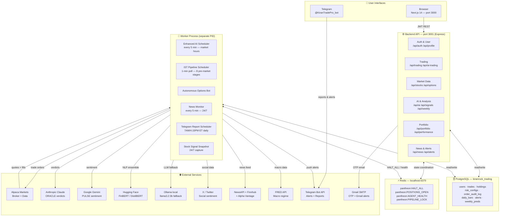
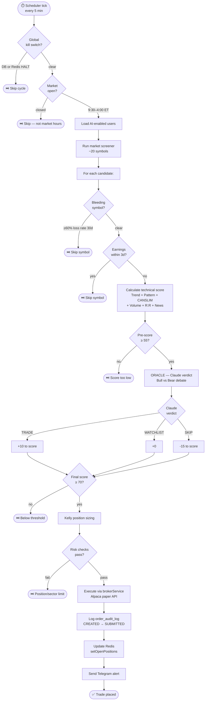
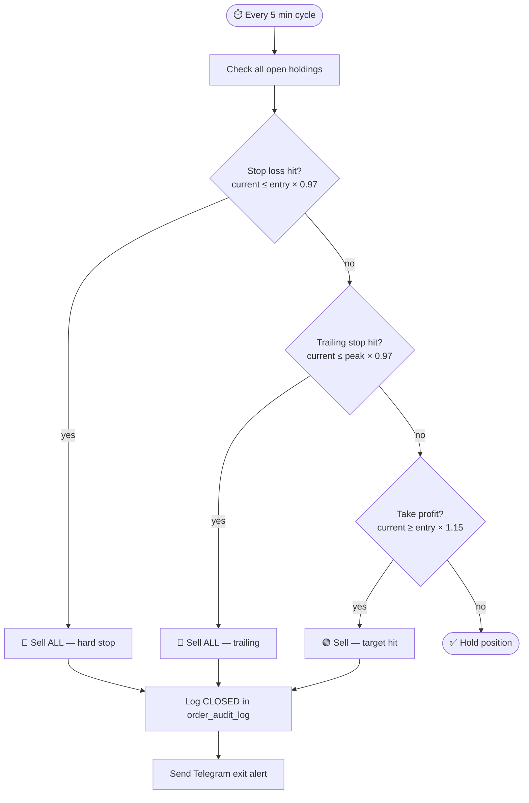
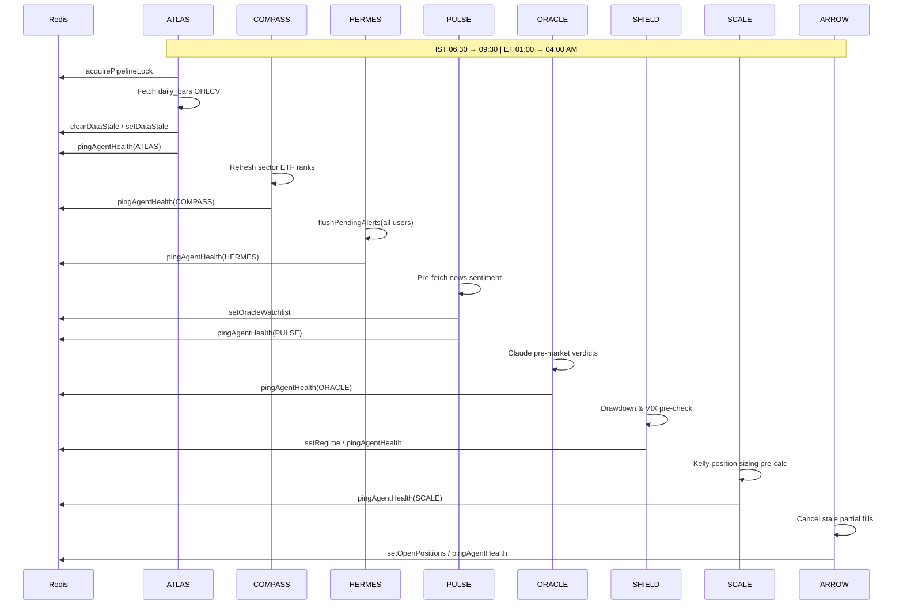
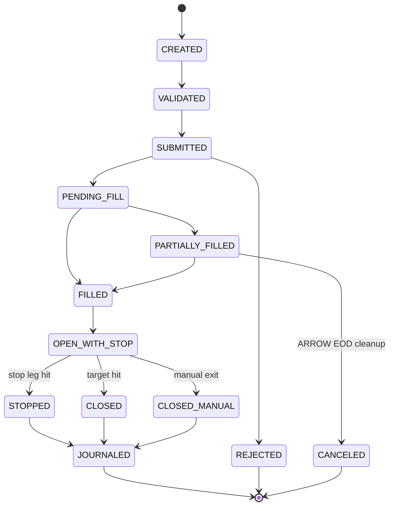
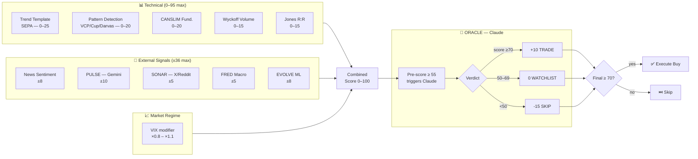
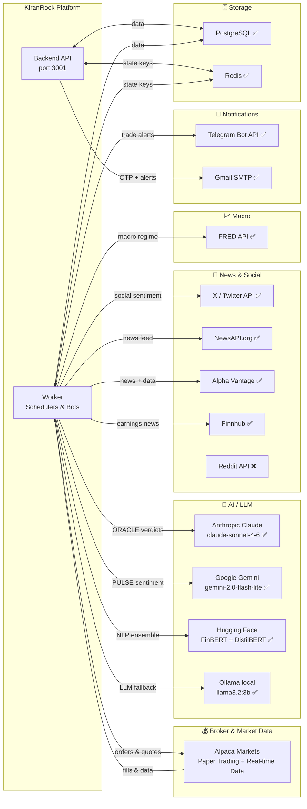

# KiranRock AI Trading Platform — Complete Technical Document

> Generated: May 18, 2026 | Last updated: May 18, 2026  
> Version: Production (paper-trading mode)

---

## Table of Contents

1. [System Overview](#1-system-overview)
2. [Architecture Diagram](#2-architecture-diagram)
3. [Process Map — How a Trade Happens](#3-process-map--how-a-trade-happens)
4. [Component Breakdown](#4-component-breakdown)
   - 4.1 Frontend (Next.js)
   - 4.2 Backend API (Express)
   - 4.3 Worker Process
   - 4.4 PANTHEON Agent Pipeline (IST Pre-Market)
   - 4.5 Database Schema (PostgreSQL)
   - 4.6 Redis State Layer
5. [AI & Scoring Pipeline](#5-ai--scoring-pipeline)
6. [Trading Bot Logic — Step by Step](#6-trading-bot-logic--step-by-step)
7. [Options Bot](#7-options-bot)
8. [External Communications](#8-external-communications)
   - 8.1 Active & Working (15 services live)
   - 8.2 Optional — Keys Not Yet Added (3 services)
   - 8.3 Deployment Considerations
9. [Security & Risk Controls](#9-security--risk-controls)
10. [Scheduler & Timing Reference](#10-scheduler--timing-reference)
11. [Environment Variable Reference](#11-environment-variable-reference)
12. [Start / Stop Procedure](#12-start--stop-procedure)

---

## 1. System Overview

KiranRock is a **self-hosted, multi-user AI-powered stock trading platform** running on Windows (local) or AWS (cloud). It supports:

- Autonomous AI stock trading (equity buys/sells)
- Autonomous options trading (calls, puts, spreads, protective puts)
- Manual trading via web UI
- Real-time news monitoring & sentiment analysis
- Backtesting against real historical PostgreSQL trade data
- Weekly/daily Telegram reports
- Multi-user accounts with per-user risk configurations

**Current mode**: Paper trading via Alpaca Paper API (real orders to Alpaca sandbox, no real money at risk).

**Stack at a glance**:

| Layer | Technology |
|-------|-----------|
| Frontend | Next.js 14, React 18, TypeScript, Tailwind CSS, Chart.js, Lightweight Charts |
| Backend API | Node.js 20, Express 4, JWT auth, Helmet, Rate limiting |
| Worker | Node.js process (schedulers, bots, Telegram) |
| Database | PostgreSQL (`kiranrock_trading`) via `pg` pool (max 20 connections) |
| Cache | In-memory (`cacheService`) + Redis (`redis@4.7.1`) for multi-process |
| AI (cloud) | Anthropic Claude (`claude-haiku-4-5-20251001`), Google Gemini, Hugging Face |
| AI (local) | Ollama (optional, zero-cost fallback) |
| Market Data | Yahoo Finance (default, free), Alpaca (real-time), Polygon.io (optional) |
| Broker | Alpaca API (paper) — simulated fallback via PostgreSQL |
| Notifications | Telegram Bot, Gmail SMTP |

---

## 2. Architecture Diagram



### ASCII Reference (text-only environments)

```
┌─────────────────────────────────────────────────────────────────────┐
│                        USER INTERFACES                               │
│                                                                     │
│  Browser (port 3000)          Telegram (@KiranTradePro_bot)         │
│  Next.js 14 Frontend          Reports / Alerts                      │
└────────────────┬────────────────────────────────────────────────────┘
                 │ HTTP REST  (JWT Bearer token)
                 ▼
┌─────────────────────────────────────────────────────────────────────┐
│                     BACKEND API  (port 3001)                        │
│                      Node.js / Express                              │
│                                                                     │
│  ┌────────────┐  ┌──────────┐  ┌──────────┐  ┌─────────────────┐  │
│  │ Auth &     │  │ Trading  │  │ Market   │  │  AI & Analysis  │  │
│  │ User Mgmt  │  │ Routes   │  │ Data     │  │  Routes         │  │
│  │ /api/auth  │  │ /api/    │  │ /api/    │  │  /api/ai        │  │
│  │ /api/prof  │  │ trading  │  │ stocks   │  │  /api/weekly    │  │
│  └────────────┘  └──────────┘  │ /api/    │  │  /api/backtest  │  │
│                                │ options  │  │  /api/signals   │  │
│  ┌────────────┐  ┌──────────┐  └──────────┘  └─────────────────┘  │
│  │ Portfolio  │  │ News &   │                                       │
│  │ /api/port  │  │ Alerts   │  34 route modules total              │
│  │ /api/perf  │  │ /api/news│                                       │
│  └────────────┘  └──────────┘                                       │
└────────────────┬────────────────────────────────────────────────────┘
                 │
        ┌────────┴────────┐
        ▼                 ▼
┌───────────────┐  ┌──────────────────────────────────────────────────┐
│  PostgreSQL   │  │              WORKER PROCESS                      │
│  Database     │  │              Node.js separate PID                │
│               │  │                                                  │
│  users        │  │  ┌─────────────────────────────────────────────┐ │
│  trades       │  │  │  Enhanced AI Trading Scheduler (every 5 min)│ │
│  holdings     │  │  │  IST Pipeline Scheduler (1-min poll)        │ │
│  accounts     │  │  │  Options Scanner Scheduler                  │ │
│  alerts       │  │  │  Autonomous Options Bot Scheduler           │ │
│  news_alerts  │  │  │  News Monitoring Service (every 5 min)      │ │
│  risk_configs │  │  │  Stock Signal Snapshot Scheduler            │ │
│  order_audit  │  │  │  Stock Signal Telegram Scheduler            │ │
│  weekly_preds │  │  │  Telegram Report Scheduler                  │ │
│  daily_bars   │  │  └─────────────────────────────────────────────┘ │
│  ohlcv_cache  │  └──────────────────────────────────────────────────┘
│  ...38 tables │
└───────────────┘

┌─────────────────────────────────────────────────────────────────────┐
│                   REDIS STATE LAYER  (localhost:6379)               │
│   pantheon:HALT_ALL │ pantheon:POSITIONS_OPEN:{uid}                 │
│   pantheon:REGIME:{market} │ pantheon:AGENT_HEALTH:{agent}          │
│   pantheon:DATA_STALE:{pipeline} │ pantheon:IST_STAGE:{uid}         │
│   pantheon:PIPELINE_LOCK:{uid}:{stage}                              │
└─────────────────────────────────────────────────────────────────────┘

┌─────────────────────────────────────────────────────────────────────┐
│                      EXTERNAL SERVICES                              │
│                                                                     │
│  Market Data        AI / LLM           Social / Alt Data           │
│  ┌─────────────┐   ┌────────────────┐  ┌──────────────────────┐   │
│  │Yahoo Finance│   │Anthropic Claude│  │ Reddit (WSB/stocks)  │   │
│  │Alpaca API   │   │Google Gemini   │  │ X/Twitter API        │   │
│  │Polygon.io   │   │Hugging Face    │  │ NewsAPI              │   │
│  │FRED (macro) │   │  FinBERT       │  │ Alpha Vantage        │   │
│  │Alpha Vantage│   │  DistilBERT    │  │ Finnhub              │   │
│  └─────────────┘   │Ollama (local)  │  └──────────────────────┘   │
│                    └────────────────┘                               │
│  Notifications                                                      │
│  ┌─────────────────────────────────────────────────┐               │
│  │ Telegram Bot API │ Gmail SMTP (OTP + alerts)    │               │
│  └─────────────────────────────────────────────────┘               │
└─────────────────────────────────────────────────────────────────────┘
```

---

## 3. Process Map — How a Trade Happens

### Trade Entry Flow



### Stop Loss / Exit Flow



### Raw ASCII reference

```
Every 5 minutes (market hours only):

SCHEDULER TICK
     │
     ▼
[1] GLOBAL KILL SWITCH CHECK
     └─ DB: global_trading_control table
     └─ Redis: pantheon:HALT_ALL
     └─ If either is set → skip cycle entirely
     │
     ▼
[2] MARKET HOURS CHECK
     └─ isMarketOpen() → 9:30 AM – 4:00 PM ET, Mon–Fri, no holidays
     └─ Closed → skip
     │
     ▼
[3] LOAD ACTIVE USERS
     └─ SELECT users WHERE ai_trading_enabled = true
     │
     ▼  (for each user)
[4] USER CONTROLS CHECK
     └─ Daily loss limit, circuit breakers, per-user kill switch
     │
     ▼
[5] MARKET SCREENER
     └─ Scan stock universe (~20 symbols)
     └─ Filters: price > $10, volume surge, RSI not overbought
     │
     ▼
[6] BLEEDING SYMBOLS GATE
     └─ getBleedingSymbols(userId): symbols with ≥60% loss rate in 30 days
     └─ Skip any symbol in bleeding list
     │
     ▼
[7] TECHNICAL SCORING (per symbol, 0–100)
     ├─ Trend Template (Minervini SEPA): SMA conditions        0–25
     ├─ Pattern Detection (VCP, Cup&Handle, Darvas)            0–20
     ├─ CANSLIM Fundamentals (EPS, Revenue, Catalyst)          0–20
     ├─ Wyckoff Volume Analysis                                0–15
     ├─ Jones Risk/Reward (R:R ratio)                          0–15
     ├─ News Sentiment (weighted)                              ±8
     ├─ Gemini PULSE (Google Gemini news analysis)             ±10
     ├─ SONAR (Reddit/X alt data)                              ±5
     ├─ FRED Macro regime (Fed rate, yield curve)              ±5
     ├─ EVOLVE ML (historical win-rate table for feature combo)±8
     └─ Market Regime (VIX-based modifier)                     modifier
     │
     ▼
[8] ORACLE GATE (Claude AI verdict)
     └─ Only runs if pre-score ≥ 55 AND ANTHROPIC_API_KEY set
     └─ Claude runs BULL vs BEAR debate → 8-step scoring → JSON verdict
     └─ TRADE  → +10 to score
     └─ SKIP   → -15 to score
     └─ WATCHLIST → 0
     │
     ▼
[9] THRESHOLD CHECK
     └─ Final score ≥ 70 (minBuyScore) → proceed to buy
     └─ < 70 → skip
     │
     ▼
[10] POSITION SIZING (Kelly)
     └─ SCALE: Kelly Criterion with max 15% cap
     └─ Checks: daily trade limit, max open positions, max sector allocation
     │
     ▼
[11] BROKER EXECUTION
     └─ BROKER=alpaca → Alpaca API order
     └─ BROKER=simulated → INSERT into trades table
     └─ order_audit_log: CREATED → VALIDATED → SUBMITTED → PENDING_FILL
     │
     ▼
[12] REDIS STATE UPDATE
     └─ setOpenPositions(userId, symbols)
     └─ pingAgentHealth('ARROW')
     │
     ▼
[13] ALERTS
     └─ Telegram alert sent to user's registered chat_id
     └─ Email alert (if configured)

STOP LOSS / TRAILING STOP (on every cycle for open positions):
     └─ stopLoss: -3% from entry → auto-sell
     └─ trailingStop: -3% from peak → auto-sell
     └─ takeProfit: +15% → partial/full exit
```

---

## 4. Component Breakdown

### 4.1 Frontend (Next.js 14)

**Port**: 3000  
**Location**: `frontend/`

| Page / Route | Description |
|-------------|-------------|
| `/` | Main dashboard — market overview, portfolio summary |
| `/dashboard` | Portfolio value chart, P&L, holdings table |
| `/ai-trading` | AI bot controls — enable/disable, risk config, current signals |
| `/options-bot` | Autonomous options bot settings and active positions |
| `/portfolio` | Full holdings with unrealized P&L |
| `/performance` | Win rate, sector breakdown, AI vs manual comparison |
| `/backtest` | Run historical backtest against real trade data |
| `/weekly` | Weekly predictions, buy lists, performance recap |
| `/recommendations` | AI stock recommendations for manual trading |
| `/alerts` | News alerts, price alerts management |
| `/news` | Aggregated news from all configured sources |
| `/scalping` | Options scalping scanner |
| `/swing-trading` | Swing trade setups |
| `/scenarios` | What-if scenario modeling |
| `/profile` | User profile, Telegram linking, risk settings |
| `/login` | JWT authentication + OTP flow |

**Key frontend libraries**:
- `lightweight-charts` — TradingView-style candlestick charts
- `chart.js` / `react-chartjs-2` — Portfolio performance charts
- `framer-motion` — Animated page transitions
- `socket.io-client` — Real-time updates from backend
- `tailwindcss` — UI styling

### 4.2 Backend API (Express)

**Port**: 3001  
**Location**: `backend/src/app.js`  
**Process**: `node src/app.js` (started separately from worker)

**Security middleware stack** (in order):
1. `helmet` — HTTP security headers (CSP disabled for Next.js compatibility)
2. `compression` — gzip all responses
3. `cors` — Allows localhost, LAN IPs, and `CORS_ORIGINS` env list
4. `express-rate-limit` — 100 req/15 min per IP on API routes
5. JWT `protect` middleware — validates Bearer token on all `/api/*` routes
6. `requestTracing` — adds request ID to every log line

**Route modules** (34 total):

| Route Prefix | Module | Main Operations |
|-------------|--------|----------------|
| `/api/auth` | authRoutes | login, register, OTP verify |
| `/api/stocks` | stockRoutes | quotes, OHLCV bars, search |
| `/api/portfolio` | portfolioRoutes | holdings, P&L, history |
| `/api/trading` | tradingRoutes | manual buy/sell, account balance |
| `/api/ai-trading` | aiTradingRoutes | bot enable/disable, status |
| `/api/enhanced-ai-trading` | enhancedAITradingRoutes | per-user risk config, force scan |
| `/api/options` | optionsRoutes | options chain, Greeks |
| `/api/options-bot` | optionsBotRoutes | bot config, active positions |
| `/api/signals` | signalRoutes | AI signal feed |
| `/api/enhanced-signals` | enhancedSignalRoutes | PANTHEON multi-agent signals |
| `/api/weekly` | weeklyRoutes | weekly predictions, recap |
| `/api/performance` | performanceRoutes | trade stats, win rates |
| `/api/backtest` | backtestRoutes | historical simulation |
| `/api/news` | newsRoutes | latest news |
| `/api/news-aggregation` | newsAggregationRoutes | multi-source aggregated feed |
| `/api/news-alerts` | newsAlertsRoutes | saved news alerts |
| `/api/alerts` | alertRoutes | price/news alert CRUD |
| `/api/watchlist` | watchlistRoutes | per-user watchlist |
| `/api/recommendations` | recommendationRoutes | AI stock picks |
| `/api/ai` | aiRoutes | multi-model AI predictions |
| `/api/indicators` | indicatorRoutes | RSI, MACD, Bollinger, etc. |
| `/api/fundamentals` | fundamentalsRoutes | EPS, revenue, margins |
| `/api/report` | reportRoutes | download CSV / weekly report |
| `/api/earnings` | earningsRoutes | upcoming earnings calendar |
| `/api/pattern` | patternRoutes | chart pattern detection |
| `/api/volume` | volumeRoutes | volume profile analysis |
| `/api/money-flow` | moneyFlowRoutes | on-balance volume, MFI |
| `/api/profile` | profileRoutes | user preferences, Telegram link |
| `/api/scalping` | scalpingRoutes | options scalping scan |
| `/api/swing-trading` | swingTradingRoutes | swing trade setups |
| `/api/screener` | screenerRoutes | stock screener |
| `/api/scenario` | scenarioRoutes | scenario modeling |
| `/api/stock-feed` | stockFeedRoutes | real-time stock feed |
| `/api/system` | systemRoutes | health, worker status, kill switch |

**Health endpoint**: `GET /health` — returns DB status, AI provider status, worker heartbeat

### 4.3 Worker Process

**Location**: `backend/src/worker.js`  
**Process**: `node src/worker.js` (started separately from API)

The worker is a **single-leader** process — it uses a `worker_coordination` table in PostgreSQL to elect a leader. If a second worker starts (e.g., on a second EC2 instance), it exits immediately, so only one instance runs all schedulers at a time.

**Services started by worker**:

```
1. Enhanced AI Scheduler     — every 5 min during market hours
2. IST Pipeline Scheduler    — 1-min poll, 8-stage pre-market sequence
3. Options Scanner Scheduler — periodic options chain scanning
4. Autonomous Options Bot    — options trade execution
5. News Monitoring Service   — every 5 min, monitors 20 symbols
6. Stock Signal Snapshot     — 24/7 signal capture
7. Stock Signal Telegram     — 24/7 signal delivery to Telegram
8. Telegram Report Scheduler — scheduled reports (Mon–Fri 7AM, 4:15PM; Sun 8AM, 9AM)
```

### 4.4 PANTHEON Agent Pipeline (IST Pre-Market)

Every morning, before the US market opens, a strict 8-stage sequence runs in IST


 (India Standard Time, UTC+5:30). Each stage has a 15-minute active window. A Redis lock (`PIPELINE_LOCK`) prevents double-runs across multiple EC2 instances.

```
┌──────────────────────────────────────────────────────────────┐
│             IST PRE-MARKET PIPELINE (daily)                  │
├─────────┬──────────┬─────────────────────────────────────────┤
│ IST     │ ET       │ Stage & Action                          │
├─────────┼──────────┼─────────────────────────────────────────┤
│ 06:30   │ 01:00 AM │ ATLAS   — Refresh daily_bars OHLCV data │
│ 06:45   │ 01:15 AM │ COMPASS — Update sector rotation ranks  │
│ 07:00   │ 01:30 AM │ HERMES  — Flush pending user alerts     │
│ 07:15   │ 01:45 AM │ PULSE   — Pre-fetch news sentiment      │
│ 07:45   │ 02:15 AM │ ORACLE  — Claude pre-market verdicts    │
│ 08:15   │ 02:45 AM │ SHIELD  — Drawdown & risk pre-check     │
│ 08:30   │ 03:00 AM │ SCALE   — Kelly position size pre-calc  │
│ 09:15   │ 03:45 AM │ ARROW   — Cancel stale partial fills    │
└─────────┴──────────┴─────────────────────────────────────────┘
```

Each stage writes its health heartbeat to Redis (`AGENT_HEALTH:{stage}`).  
ATLAS failure sets `DATA_STALE:atlas` — trading bot reads this and proceeds with caution.

### 4.5 Database Schema (PostgreSQL)

**Database**: `kiranrock_trading`  
**Connection pool**: max 20 connections, 30s idle timeout

**Core tables**:

| Table | Purpose |
|-------|---------|
| `users` | Accounts: id, username, email, password_hash, telegram_chat_id |
| `risk_configs` | Per-user risk params: minBuyScore=70, stopLoss=-3%, trailing=3% |
| `global_trading_control` | System-wide kill switch |
| `user_trading_controls` | Per-user kill switches, circuit breakers |
| `trades` | All executed trades: symbol, action, qty, price, ai_score, sector |
| `holdings` | Current open positions per user |
| `trading_accounts` | Balance, buying power, cash reserved |
| `order_audit_log` | Full order state machine (CREATED→JOURNALED) |
| `alerts` | User-defined price alerts |
| `news_alerts` | Automated news alerts from monitoring service |
| `news_monitor_runs` | Metadata for each news monitoring cycle |
| `daily_bars` | OHLCV market data store (populated by ATLAS) |
| `ohlcv_cache` | Local OHLCV cache for EVOLVE ML training |
| `weekly_predictions` | AI weekly buy list snapshots |
| `weekly_prediction_snapshots` | Archived weekly predictions |
| `portfolio_history` | Daily portfolio value snapshots |
| `stock_signal_snapshots` | Captured AI signals |
| `scheduler_logs` | Scheduler run logs |
| `worker_coordination` | Single-leader election for worker process |
| `trade_intelligence` | AI scoring metadata per trade |

**order_audit_log state machine**:



```
CREATED ──► VALIDATED ──► SUBMITTED ──► PENDING_FILL ──► PARTIALLY_FILLED
                                                                │
                                                                ▼
                                                             FILLED ──► OPEN_WITH_STOP
                                                                              │
                                                    ┌─────────────────────────┤
                                                    ▼         ▼              ▼
                                                 STOPPED   CLOSED    CLOSED_MANUAL
                                                    │         │              │
                                                    └────┬────┘──────────────┘
                                                         ▼
                                                      JOURNALED

Terminal states (no further transitions):
  REJECTED — order rejected by broker
  CANCELED — canceled manually or by ARROW EOD cleanup
```

### 4.6 Redis State Layer

**URL**: `redis://localhost:6379` (or `REDIS_URL` env var)  
**File**: `backend/src/services/redisStateService.js`

All keys use prefix `pantheon:`. **All operations fail-open gracefully** — if Redis is unavailable, trading continues normally with no-op defaults.

| Redis Key | TTL | Purpose |
|-----------|-----|---------|
| `pantheon:HALT_ALL` | Permanent | Emergency stop for all bots across all processes |
| `pantheon:POSITIONS_OPEN:{userId}` | 10 min | JSON array of open symbol names per user |
| `pantheon:ORACLE_WATCHLIST` | 1 hour | Symbols queued for ORACLE Claude analysis |
| `pantheon:REGIME:{market}` | 15 min | Market regime: bullish/neutral/bearish |
| `pantheon:DATA_STALE:atlas` | 5 min | Set when ATLAS market data fetch fails |
| `pantheon:AGENT_HEALTH:{agent}` | 5 min | Last heartbeat timestamp per pipeline stage |
| `pantheon:PIPELINE_LOCK:{uid}:{stage}` | 30 min | Mutex preventing multi-EC2 double-run |
| `pantheon:IST_STAGE:{uid}` | 1 hour | Current pipeline stage for a user session |

---

## 5. AI & Scoring Pipeline

The bot uses a **multi-layer AI ensemble** to score every stock opportunity. Each component contributes to a final 0–100 score.



```
┌─────────────────────────────────────────────────────────────┐
│              PANTHEON SCORING PIPELINE                      │
│                                                             │
│  Component                     Score Range   Source        │
│  ─────────────────────────────────────────────────────────  │
│  1. Trend Template (SEPA)       0–25          Technical     │
│  2. Pattern Detection           0–20          Technical     │
│  3. CANSLIM Fundamentals        0–20          Technical     │
│  4. Wyckoff Volume              0–15          Technical     │
│  5. Jones R/R                   0–15          Technical     │
│  ─────────────────────────────────────────────────────────  │
│  6. News Sentiment (basic)       ±8           Free APIs     │
│  7. PULSE (Gemini news)          ±10          Gemini API    │
│  8. SONAR (Reddit/X alt data)    ±5           Reddit/X API  │
│  9. FRED Macro                   ±5           FRED API      │
│  10. EVOLVE ML (win-rate table)  ±8           DB/OHLCV      │
│  ─────────────────────────────────────────────────────────  │
│  11. Market Regime Modifier     ×0.8–×1.1    VIX           │
│  ─────────────────────────────────────────────────────────  │
│  12. ORACLE Claude verdict      +10/0/−15    Anthropic API  │
│       (TRADE / WATCHLIST / SKIP)                            │
│  ─────────────────────────────────────────────────────────  │
│  FINAL THRESHOLD: ≥ 70 → execute buy                        │
└─────────────────────────────────────────────────────────────┘
```

**ORACLE (Claude) 8-Step Scoring**:

The ORACLE agent runs a bull-vs-bear internal debate (PANTHEON SYSTEM_PROMPT) then scores each stock across these dimensions:

```
Step 1: WEINSTEIN GATE  — Stage 3 or 4 = instant SKIP
Step 2: TREND TEMPLATE  — 5 MA conditions × 5pt = max 25
Step 3: PATTERN         — VCP=10, Cup&Handle=9, Darvas=8
Step 4: CANSLIM         — EPS, Revenue, Margins, Catalyst
Step 5: WYCKOFF VOLUME  — Volume distribution up/down breakout
Step 6: JONES R/R       — ≥3:1 R/R = max score
Step 7: GEMINI BONUS    — Bullish +5, Bearish -10
Step 8: SMART MONEY     — Institutional +8, Insider buy +5

VERDICT: ≥70 → TRADE (+10) | 50–69 → WATCHLIST (0) | <50 → SKIP (-15)
```

**JSON parse safety**: If Claude returns malformed JSON, `tryParse()` strips markdown fences and retries with `strictMode=true` ("Respond with ONLY raw JSON, no markdown").

**Fallback chain**: Anthropic API → Ollama local LLM (if `OLLAMA_BASE_URL` set) → code score only

---

## 6. Trading Bot Logic — Step by Step

### Entry Logic

```
Every 5 minutes:
  For each AI-enabled user:
    1. Load risk_config from DB (or DEFAULT: minBuyScore=70, stopLoss=-3%, trailing=3%)
    2. Check daily trade count (default max 10/day)
    3. Run market screener → top candidates
    4. For each candidate:
       a. Check bleeding symbols gate (≥60% loss rate last 30d → skip)
       b. Calculate earnings proximity (skip if earnings within 3 days)
       c. Build full technical score
       d. If score ≥ 55 AND ANTHROPIC_API_KEY set → call ORACLE
       e. If final score ≥ minBuyScore(70) → size position
       f. Check: max open positions, max sector allocation, available cash
       g. Execute buy via brokerService
       h. Log to order_audit_log (CREATED → SUBMITTED)
       i. Send Telegram alert
```

### Exit Logic (checked on every cycle)

```
For each open holding:
  - STOP LOSS:      current_price ≤ entry × (1 + stopLoss)  = entry × 0.97 → SELL ALL
  - TRAILING STOP:  current_price ≤ peak_price × (1 - trailing) = peak × 0.97 → SELL ALL
  - TAKE PROFIT:    current_price ≥ entry × (1 + takeProfit) = +15% → SELL (partial or full)
  - EOD CLEANUP:    15:44–15:59 ET → cancel any SUBMITTED/PARTIALLY_FILLED orders > 30 min old
```

### Risk Configuration (per-user, from DB `risk_configs`)

| Parameter | Default | Description |
|-----------|---------|-------------|
| `minBuyScore` | 70 | Minimum AI score to execute buy |
| `stopLoss` | -3% | Hard stop loss from entry |
| `trailingStopPercent` | 3% | Trailing stop from peak |
| `takeProfitPercent` | 15% | Auto take-profit target |
| `maxOpenPositions` | 10 | Max concurrent holdings |
| `maxPortfolioRisk` | 0.20 | Max 20% of portfolio in any one position |
| `maxSectorAllocation` | 0.30 | Max 30% per sector |
| `dailyLossLimit` | 5% | Halt if portfolio drops 5% in a day |
| `maxVix` | 35 | Halt trading above this VIX level |
| `maxDailyTrades` | 10 | Max trades per day per user |

---

## 7. Options Bot

**Service**: `backend/src/services/autonomousOptionsBot.js`  
**Scheduler**: `backend/src/services/optionsBotScheduler.js`

### Strategies

| Strategy | Capital Allocation | Timeframe | Target Return |
|----------|-------------------|-----------|---------------|
| Delta-Neutral Scalping | 30% | Intraday | 20% |
| Directional Swing | 40% | 2–5 days | 35% |
| Credit Spreads | 20% | 7–30 days | 15% |
| Protective Puts | 10% | Portfolio hedge | Risk reduction |

### Options Entry Criteria

```
Greeks:
  Gamma ≥ 0.05        (fast delta movement for scalping)
  Delta 0.40–0.70     (ITM enough for reliable tracking)
  Vega ≥ 0.10         (volatility sensitivity)
  Theta ≥ -0.50       (cap time decay)

Liquidity:
  Volume ≥ 500/day
  Open Interest ≥ 1,000
  Bid/Ask spread ≤ 15%

Expiry:
  7–45 days to expiration (gamma sweet spot)

IV: 20%–150% (avoid penny and meme extremes)
Price: $0.50–$15.00 per contract
```

### Account Limits

- Minimum account balance to trade options: $10,000
- Max account at risk: 10%
- Max per-position risk: 2%
- Max concurrent options positions: 5

---

## 8. External Communications

> Last audited: May 18, 2026

### External Communications Map



### 8.1 Active & Working (15 services live)

| Service | Protocol | What It Does | Status |
|---------|----------|-------------|--------|
| **PostgreSQL** | TCP 5432 | Primary data store — all trades, users, history | ✅ Connected |
| **Alpaca Markets API** | HTTPS | Paper trading broker — order placement, account balance (`ALPACA_PAPER=true`) | ✅ Key set |
| **Alpaca Market Data** | HTTPS | Real-time quotes & OHLCV bars (`DATA_PROVIDER=alpaca`) | ✅ Key set |
| **Telegram Bot** | HTTPS | Trade alerts + scheduled reports (@KiranTradePro_bot) | ✅ Token set |
| **Redis** | TCP 6379 | PANTHEON multi-process state coordination | ✅ localhost auto |
| **Anthropic Claude** | HTTPS | ORACLE trade verdicts — `claude-sonnet-4-6` | ✅ Key set |
| **Google Gemini** | HTTPS | PULSE news sentiment — `gemini-2.0-flash-lite` | ✅ Key set |
| **Hugging Face** | HTTPS | FinBERT + DistilBERT financial NLP ensemble | ✅ Key set |
| **Ollama (local)** | HTTP 11434 | Free local LLM (`llama3.2:3b`) — Claude fallback | ✅ Installed & model downloaded |
| **X / Twitter API** | HTTPS | Real-time tweet sentiment for stocks | ✅ Bearer token set |
| **NewsAPI.org** | HTTPS | Aggregated market news articles | ✅ Key set |
| **Alpha Vantage** | HTTPS | Supplementary market data + news sentiment | ✅ Key set |
| **Finnhub** | HTTPS | Company news + earnings calendar | ✅ Key set |
| **Gmail SMTP** | SMTP 587 | OTP verification emails + trade alert emails | ✅ tradeagent0007@gmail.com |
| **FRED API** | HTTPS | SHIELD macro regime: Fed funds rate, yield curve, unemployment | ✅ Key set |

**AI fallback chain (ORACLE)**: Claude `claude-sonnet-4-6` → Ollama `llama3.2:3b` (local) → code score only

### 8.2 Optional — Keys Not Yet Added

| Service | What It Adds | How to Get | Score Impact |
|---------|-------------|-----------|----------|
| **Reddit API** | SONAR: WSB/stocks/investing mention volume & sentiment | [reddit.com/prefs/apps](https://www.reddit.com/prefs/apps) — free script app | ±5 per trade |
| **Polygon.io** | Real-time options Greeks + faster quotes (replaces Yahoo delay) | [polygon.io](https://polygon.io) — Starter $29/mo | Real-time data |

### 8.3 Deployment Considerations

| Feature | Current Status | What's Needed |
|---------|---------------|---------------|
| **Real money trading** | LOCKED (`ALPACA_PAPER=true`) | Only after 6 months paper + Sharpe > 1.5 + drawdown < 15% |
| **Production deployment** | Dev mode (`NODE_ENV=development`) | SSL/reverse proxy, update `CORS_ORIGINS`, `NODE_ENV=production` |
| **India market** | Deferred | India broker API, INR support, NSE/BSE feeds |
| **Multi-EC2 Redis** | localhost only | Point `REDIS_URL` to shared AWS ElastiCache |
| **External access** | Available at `http://99.47.183.33:3000` | Port forwarding already in place |

---

## 9. Security & Risk Controls

### Authentication
- JWT Bearer tokens, 64-byte random secret (`JWT_SECRET` env var)
- Tokens verified on every API route via `protect` middleware
- Users looked up from PostgreSQL on each request (no JWT payload trust beyond ID)
- OTP via email for account verification

### Rate Limiting
- API routes: 100 requests per 15 minutes per IP
- Telegram send: exponential backoff (3 retries, max 10s wait)
- Yahoo Finance: built-in retry + 15-min cache on all calls
- Hugging Face: auto-cooldown after 3 consecutive 429s (10-min cooldown)

### Trading Circuit Breakers (DB-enforced)

| Breaker | Trigger | Action |
|---------|---------|--------|
| `CIRCUIT_HALT_STREAK` | 5 consecutive losses | Halt all trading |
| `CIRCUIT_REDUCE_STREAK` | 3 consecutive losses | Reduce position sizes |
| `MAX_DRAWDOWN_PCT` | Portfolio drops 15% from peak | Halt all trading |
| `DATA_MAX_AGE_MS` | Market data older than 2 min | Halt trading, set DATA_STALE |
| `MAX_VIX` | VIX ≥ 35 | Halt trading |
| `DAILY_LOSS_LIMIT` | Portfolio drops 5% in one day | Halt user's trading |

### Kill Switches (layered)

```
Level 1: Redis HALT_ALL          — instant, cross-process, survives restart
Level 2: global_trading_control  — DB-level, affects all users
Level 3: user_trading_controls   — per-user kill switch
Level 4: risk_config limits      — per-user automated via circuit breakers
```

### Data Security
- Passwords hashed with `bcrypt` (rounds=10)
- `.env` file never committed (`.gitignore` enforced)
- Helmet sets security headers on all responses
- SQL queries use parameterized statements (`$1`, `$2`...) throughout — no string interpolation
- `order_audit_log` is append-only — no UPDATE or DELETE ever issued

---

## 10. Scheduler & Timing Reference

All times are approximate — 1-minute polling loop resolves actual execution.

| Schedule | Time (IST) | Time (ET) | Job |
|----------|-----------|-----------|-----|
| IST ATLAS | 06:30 daily | 01:00 AM | Market data refresh |
| IST COMPASS | 06:45 daily | 01:15 AM | Sector rotation ranks |
| IST HERMES | 07:00 daily | 01:30 AM | Flush alerts |
| IST PULSE | 07:15 daily | 01:45 AM | News pre-fetch |
| IST ORACLE | 07:45 daily | 02:15 AM | Claude pre-market |
| IST SHIELD | 08:15 daily | 02:45 AM | Risk pre-check |
| IST SCALE | 08:30 daily | 03:00 AM | Kelly sizing pre-calc |
| IST ARROW | 09:15 daily | 03:45 AM | Cancel stale orders |
| AI Trading Bot | Every 5 min | 9:30 AM–4:00 PM ET | Scan + trade |
| EOD Cleanup | 15:44–15:59 ET daily | — | Cancel partial fills |
| News Monitor | Every 5 min | 24/7 | Monitor top 20 symbols |
| Telegram predictions | 7:00 AM ET | Mon–Fri | Daily predictions |
| Telegram AI summary | 4:15 PM ET | Mon–Fri | Bot performance recap |
| Telegram weekly buy | 8:00 AM ET | Sunday | Weekly buy list |
| Telegram weekly recap | 9:00 AM ET | Sunday | Weekly performance |
| Stock snapshots | Every hour | 24/7 | Signal capture |

---

## 11. Environment Variable Reference

Full list of variables (from `.env.example`):

### Required (platform will not start correctly without these)

| Variable | Example | Purpose |
|----------|---------|---------|
| `PORT` | `3001` | Backend API port |
| `DB_HOST` | `localhost` | PostgreSQL host |
| `DB_PORT` | `5432` | PostgreSQL port |
| `DB_NAME` | `kiranrock_trading` | Database name |
| `DB_USER` | `postgres` | DB username |
| `DB_PASSWORD` | `your_password` | DB password |
| `JWT_SECRET` | `64-char-hex-string` | JWT signing key |

### Market Data & Broker

| Variable | Default | Purpose |
|----------|---------|---------|
| `DATA_PROVIDER` | `yahoo` | `yahoo` \| `alpaca` \| `polygon` |
| `ALPACA_KEY_ID` | — | Alpaca API key |
| `ALPACA_SECRET_KEY` | — | Alpaca API secret |
| `ALPACA_PAPER` | `true` | `true`=paper, `false`=REAL MONEY |
| `BROKER` | `simulated` | `simulated` \| `alpaca` |
| `POLYGON_API_KEY` | — | Polygon.io key (if using Polygon) |
| `BOT_ENABLED` | `true` | Master bot on/off switch |
| `MAX_BOT_INVESTMENT_USD` | `5000` | Max total bot investment |

### AI / LLM

| Variable | Default | Purpose |
|----------|---------|---------|
| `ANTHROPIC_API_KEY` | — | Claude API (ORACLE verdicts) |
| `CLAUDE_MODEL` | `claude-haiku-4-5-20251001` | Claude model name |
| `GEMINI_API_KEY` | — | Google Gemini (PULSE sentiment) |
| `GEMINI_MODEL` | `gemini-2.0-flash-lite` | Gemini model |
| `HUGGINGFACE_API_KEY` | — | FinBERT / DistilBERT |
| `OLLAMA_BASE_URL` | — | Local Ollama (e.g. `http://localhost:11434`) |
| `OLLAMA_MODEL` | `llama3.2:3b` | Ollama model |

### News & Social Data

| Variable | Default | Purpose |
|----------|---------|---------|
| `NEWSAPI_KEY` | — | NewsAPI.org |
| `ALPHA_VANTAGE_KEY` | — | Alpha Vantage data |
| `FINNHUB_KEY` | — | Finnhub news |
| `X_BEARER_TOKEN` | — | X/Twitter API v2 |
| `REDDIT_CLIENT_ID` | — | Reddit OAuth client |
| `REDDIT_SECRET` | — | Reddit OAuth secret |
| `FRED_API_KEY` | — | FRED macro data |

### Notifications

| Variable | Purpose |
|----------|---------|
| `TELEGRAM_BOT_TOKEN` | Telegram bot token |
| `TELEGRAM_CHAT_ID` | Default Telegram chat ID |
| `EMAIL_SERVICE` | `gmail` \| `outlook` |
| `EMAIL_USER` | Sender email address |
| `EMAIL_PASSWORD` | Gmail App Password |

### Circuit Breakers

| Variable | Default | Purpose |
|----------|---------|---------|
| `CIRCUIT_HALT_STREAK` | `5` | Consecutive losses → halt |
| `CIRCUIT_REDUCE_STREAK` | `3` | Consecutive losses → reduce size |
| `MAX_DRAWDOWN_PCT` | `15` | Portfolio drawdown % → halt |
| `DATA_MAX_AGE_MS` | `120000` | Market data staleness threshold |

### Redis

| Variable | Default | Purpose |
|----------|---------|---------|
| `REDIS_URL` | `redis://localhost:6379` | Redis connection URL |

---

## 12. Start / Stop Procedure

### Starting All Services

```powershell
# From C:\MyProject\KiranRock
.\start.ps1
```

This script:
1. Stops any existing KiranRock processes (by PID tracking)
2. Starts **Backend API** (`node src/app.js`) on port 3001
3. Waits 10 seconds for DB to connect
4. Starts **Worker** (`node src/worker.js`) — all schedulers + bots
5. Runs one-time **stock signal delivery** pass
6. Starts **Frontend** (`next build` then `next start`) on port 3000

### Stopping

Re-run `.\start.ps1` — it automatically stops existing processes first, or close the named terminal windows.

### Manual Commands

```powershell
# Backend only
cd backend ; node src/app.js

# Worker only
cd backend ; node src/worker.js

# Frontend only
cd frontend ; npm run build ; npm start

# Run stock signals once
cd backend ; npm run run:stock-signals

# Run database migrations
cd backend ; npm run migrate

# Check backend health
Invoke-WebRequest http://localhost:3001/health | Select-Object -Expand Content
```

### Process Architecture

```
start.ps1
├── Terminal: KiranRock backend    → node src/app.js      (port 3001)
├── Terminal: KiranRock worker     → node src/worker.js   (schedulers)
├── Terminal: KiranRock delivery   → npm run:stock-signals (one-shot)
└── Terminal: KiranRock frontend   → next start           (port 3000)
```

Each runs in its own named PowerShell terminal, tracked by PID in `.startup-status/`.

---

## Relationship Map (Venn-style)

```
╔══════════════════════════════════════════════════════════════════╗
║                    KiranRock Platform                           ║
║                                                                 ║
║  ┌─────────────────────┐   ┌─────────────────────────────────┐ ║
║  │   USER-FACING       │   │       AUTOMATED                 │ ║
║  │   (Manual)          │   │       (AI Bots)                 │ ║
║  │                     │   │                                 │ ║
║  │  Next.js UI         │   │  AI Trading Bot                 │ ║
║  │  Dashboard          │   │  Options Bot                    │ ║
║  │  Charts             │   │  IST Pipeline                   │ ║
║  │  Manual Trading     │◄─►│  News Monitor                   │ ║
║  │  Backtest           │   │  Telegram Reports               │ ║
║  │  Weekly Preds       │   │  Signal Snapshots               │ ║
║  │  Profile & Alerts   │   │                                 │ ║
║  └──────────┬──────────┘   └──────────────┬──────────────────┘ ║
║             │                             │                     ║
║             └──────────┬──────────────────┘                     ║
║                        ▼                                        ║
║           ┌─────────────────────────────┐                       ║
║           │     SHARED CORE             │                       ║
║           │  Express API  (port 3001)   │                       ║
║           │  PostgreSQL   (port 5432)   │                       ║
║           │  Redis        (port 6379)   │                       ║
║           │  JWT Auth                   │                       ║
║           │  brokerService (Alpaca)     │                       ║
║           │  dataProvider  (Yahoo/Alpaca│                       ║
║           └─────────────────────────────┘                       ║
║                        ▼                                        ║
║           ┌─────────────────────────────┐                       ║
║           │    AI SCORING LAYERS        │                       ║
║           │                             │                       ║
║           │  ┌──────────┐ ┌──────────┐  │                       ║
║           │  │Technical │ │External  │  │                       ║
║           │  │Indicators│ │AI APIs   │  │                       ║
║           │  │RSI,MACD  │ │Claude    │  │                       ║
║           │  │Patterns  │ │Gemini    │  │                       ║
║           │  │Volume    │ │HuggFace  │  │                       ║
║           │  │CANSLIM   │ │FRED Macro│  │                       ║
║           │  └──────────┘ └──────────┘  │                       ║
║           │                             │                       ║
║           │  ┌──────────┐ ┌──────────┐  │                       ║
║           │  │Local ML  │ │Social/Alt│  │                       ║
║           │  │EVOLVE    │ │Reddit    │  │                       ║
║           │  │Ollama    │ │X/Twitter │  │                       ║
║           │  │(optional)│ │NewsAPI   │  │                       ║
║           │  └──────────┘ └──────────┘  │                       ║
║           └─────────────────────────────┘                       ║
╚══════════════════════════════════════════════════════════════════╝
```

---

*Document reflects codebase state as of May 18, 2026. All 6 PANTHEON spec files are deployed and syntax-verified. Server is running.*
